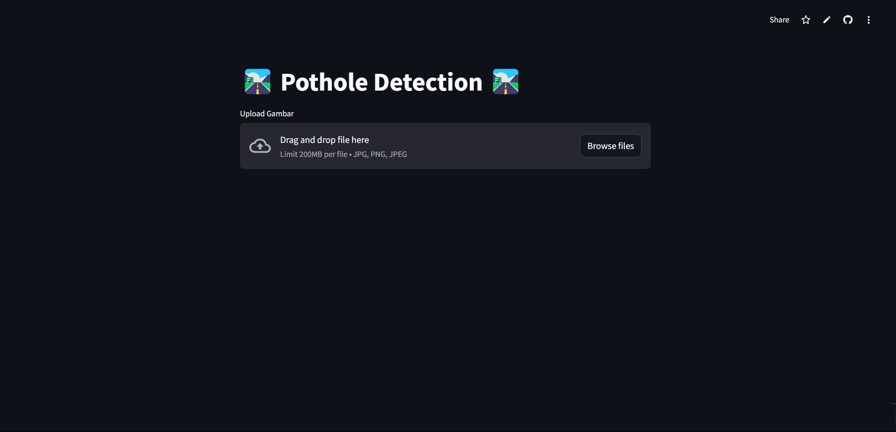
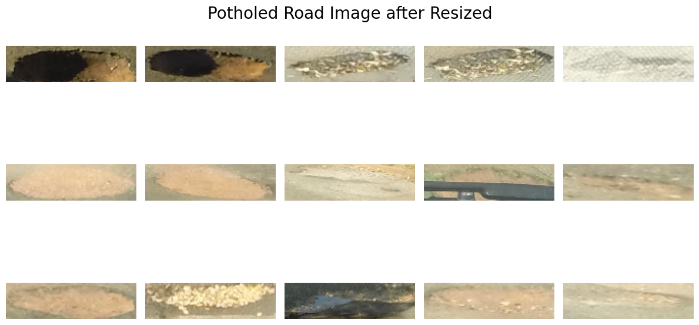
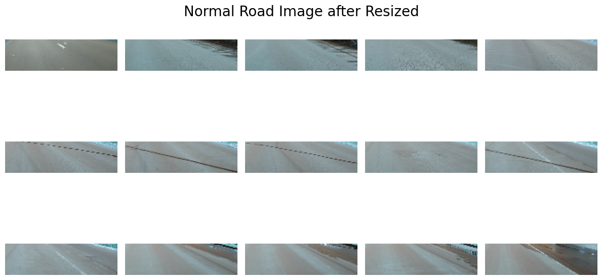
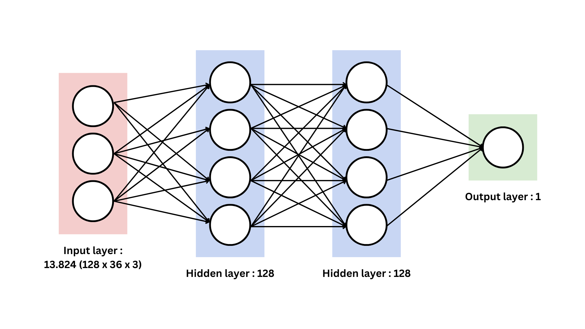

# Road Pothole Classification with Perceptron (From Scratch)

## Overview
This project implements a multilayer perceptron model with backpropagation for road pothole classification entirely from scratch. The model is trained to identify whether an image contains a pothole or not.



## Dataset
### Raw Dataset
The dataset used for this project consists of road images, some containing potholes and others without potholes that we get from https://www.kaggle.com/datasets/sovitrath/road-pothole-images-for-pothole-detection/data?select=train_df.csv. Below is a sample of the raw dataset:


### Preprocessed Dataset
Before training the model, the dataset undergoes preprocessing, which includes:
1. Resizing images to a fixed dimension (e.g., 64x64).
2. Normalizing pixel values.
3. Converting labels into binary values (1 for pothole, 0 for no pothole).

A sample of the preprocessed dataset:




## Model Information
### Layer Configuration

The perceptron model is designed as follows:
- **Input Layer**: [Input size, e.g., 128x36x3 flattened into 13.824 nodes]
- **Hidden Layers**: [2 hidden layer with 128 nodes]
- **Output Layer**: 1 node (binary classification)

### Activation Functions
- Hidden Layer(s): ReLU
- Output Layer: Sigmoid

### Optimization
- Loss Function: Binary Cross-Entropy
- Optimizer: Gradient Descent with Backpropagation

## Results
The following metrics were used to evaluate the model:
| Model             | Accuracy (%) |
|-------------------|--------------|
| Multilayer Perceptron          | 95.6        |


## Streamlit App
A Streamlit app has been developed to demonstrate the model's capabilities. You can upload an image to see if it detects a pothole.

[Click here to access the Streamlit App](https://pothole-detection-kel08.streamlit.app/)

## How to Run Locally
1. Clone this repository:
   ```bash
   git clone https://github.com/username/road-pothole-classification.git
   ```
2. Install dependencies:
   ```bash
   pip install -r requirements.txt
   ```
3. Run the Streamlit app:
   ```bash
   streamlit run app.py
   ```

## License
This project is licensed under the [LICENSE_NAME]. See the LICENSE file for details.

## Contact
For any questions or feedback, please contact [fadhilahhilmi04@gmail.com].